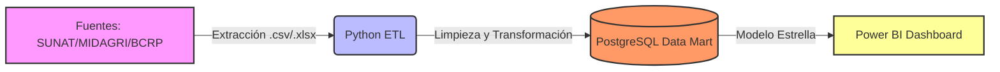
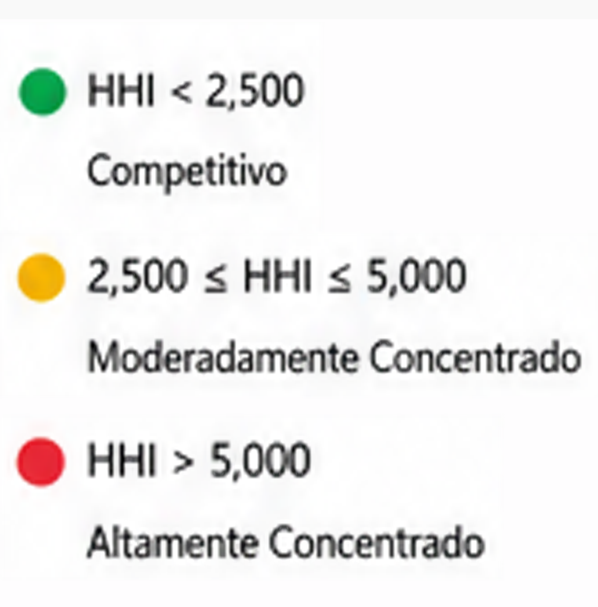
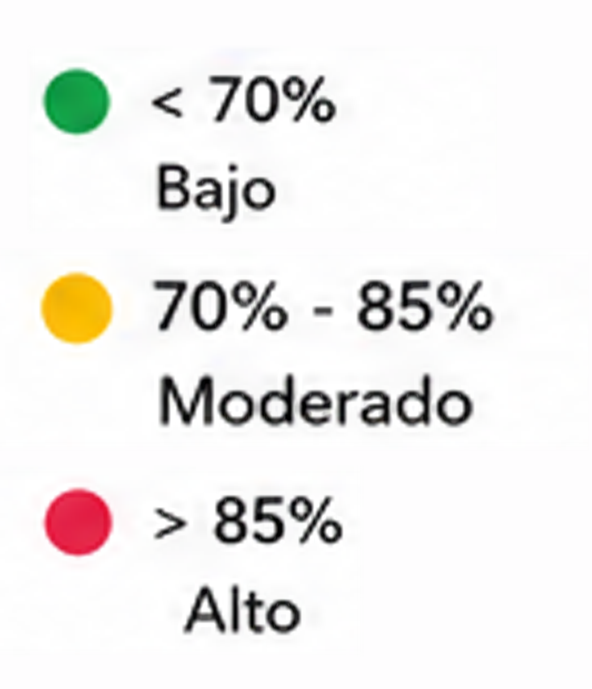

<div align="center">
  <h1>🥑 Data Mart - Rentabilidad de Palta Hass</h1>
  
  <p><strong>Proyecto Integral de Inteligencia de Negocios y Data Engineering para el análisis de exportación peruana.</strong></p>

  [](https://opensource.org/licenses/MIT)
  [](https://www.python.org/downloads/)
  [](https://www.postgresql.org/)
  [](https://powerbi.microsoft.com/)
</div>

<hr />

## 📖 Acerca del Proyecto

Este repositorio contiene la solución completa de Inteligencia de Negocios diseñada para analizar la **rentabilidad de la exportación de Palta Hass peruana**. El proyecto extrae información cruda de fuentes gubernamentales (SUNAT, MIDAGRI, BCRP), la procesa y la modela en un Data Mart centralizado (PostgreSQL), para finalmente exponer métricas clave a través de tableros interactivos en Power BI.

Ideal para tomadores de decisiones, analistas de datos y profesionales de comercio exterior que buscan entender el comportamiento del mercado de exportación de uno de los productos bandera del Perú.

## 🎯 Objetivos de Negocio

- **Métricas de Rentabilidad**: Calcular el Valor FOB y el Volumen Exportado de forma precisa.
- **Análisis de Costos**: Evaluar costos operativos, logísticos y financieros frente a los ingresos por exportación.
- **Identificación de Mercados**: Analizar el comportamiento de compra por país y continente, evaluando el impacto de Tratados de Libre Comercio (TLC).
- **Tendencias Temporales**: Identificar estacionalidad y picos de demanda a lo largo del año.

---

## 🏗️ Arquitectura de Datos

El flujo de procesamiento sigue un enfoque moderno de ETL (Extract, Transform, Load):



1. **Extracción**: Scripts en Python leen la data cruda desde la carpeta `data/raw/`.
2. **Transformación**: Se limpian inconsistencias, se normalizan textos y se generan dimensiones usando `pandas`.
3. **Carga**: Se insertan los datos limpios en tablas dimensionales y de hechos en PostgreSQL vía `SQLAlchemy`.
4. **Visualización**: Se conecta Power BI a la base de datos para consumir el modelo en forma de estrella.

---

## 📂 Estructura del Repositorio

```text
📦 datamart-palta-hass-bi
 ┣ 📂 assets/            # Imágenes, íconos y recursos visuales para documentación
 ┣ 📂 backups/           # Respaldos de base de datos SQL (Ignorados en Git)
 ┣ 📂 data/              # Archivos de datos de origen (Raw y Processed)
 ┣ 📂 docs/              # Diccionarios de datos, guías y documentos académicos
 ┣ 📂 reports/           # Entregables: Plantillas Power BI (.pbit), PDFs y Word
 ┣ 📂 sql/               # DDL Scripts para creación de tablas en PostgreSQL
 ┗ 📂 src/
   ┣ 📂 analysis/        # Scripts analíticos (estacionalidad, validación DAX)
   ┣ 📂 etl/             # Pipeline principal de carga de dimensiones y hechos
   ┗ 📂 utils/           # Herramientas de soporte (procesamiento de PDFs, Word)
```

---

## 🚀 Guía de Inicio Rápido (Getting Started)

Si acabas de clonar el repositorio y no sabes por dónde empezar, sigue estos pasos:

### 1. Prerrequisitos
- Python 3.9 o superior.
- Motor de base de datos PostgreSQL instalado y corriendo.
- (Opcional) Power BI Desktop para abrir los tableros.

### 2. Instalación

Clona el repositorio e instala las dependencias de Python:
```bash
git clone https://github.com/luzylay/datamart-palta-hass-bi.git
cd datamart-palta-hass-bi
pip install -r requirements.txt
```

### 3. Configuración de Base de Datos
Ejecuta los scripts ubicados en la carpeta `sql/` (ej. `ddl.sql` o `Palta_Hass_DM.sql`) en tu cliente de PostgreSQL (pgAdmin o DBeaver) para construir la estructura relacional vacía.

### 4. Ejecución del Pipeline ETL
Navega a la carpeta de ETL y ejecuta los scripts en el siguiente orden para poblar el Data Mart:

```bash
# 1. Dimensiones básicas
python src/etl/ETL_SUNAT_DIMENSIONES.py
# 2. Dimensiones financieras y de costos
python src/etl/Cargar_DIM_FINANZAS.py
python src/etl/ETL_DIM_COSTO.py
python src/etl/ETL_DIM_PAIS_TLC.py
# 3. Tabla de hechos
python src/etl/ETL_FACT_RENTABILIDAD.py
# 4. Generación de KPIs
python src/etl/ETL_Palta_Hass.py
```

---

## 📊 Tableros y Reportes

En la carpeta `reports/powerbi/` encontrarás el archivo `Proyecto-Equipo1.pbit`. 
Al abrir esta plantilla en Power BI, te pedirá las credenciales de tu base de datos local PostgreSQL. Una vez conectada, los gráficos interactivos cobrarán vida, permitiéndote explorar la rentabilidad por puerto, exportador, continente y fecha.

<div align="center">
  
  <br>
  <em>Vista principal del Dashboard de Rentabilidad de Palta Hass.</em>
</div>

<br>

<div align="center">
  
  <br>
  <em>Desglose de exportaciones y análisis financiero.</em>
</div>

Para leer el análisis exhaustivo del proyecto, consulta la carpeta `reports/documents/` donde encontrarás el PDF final.

---

## 🤝 Contribuciones
¡Las contribuciones son bienvenidas! Si deseas mejorar los scripts ETL, añadir un análisis exploratorio de datos (EDA) o mejorar el dashboard, por favor lee nuestra [Guía de Contribución](CONTRIBUTING.md) para saber cómo empezar.

---
**Desarrollado con ❤️ por el Grupo 01 - BI Course.**
